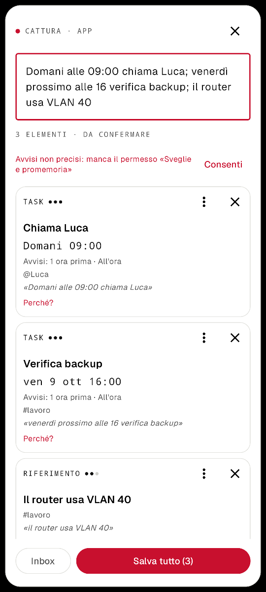
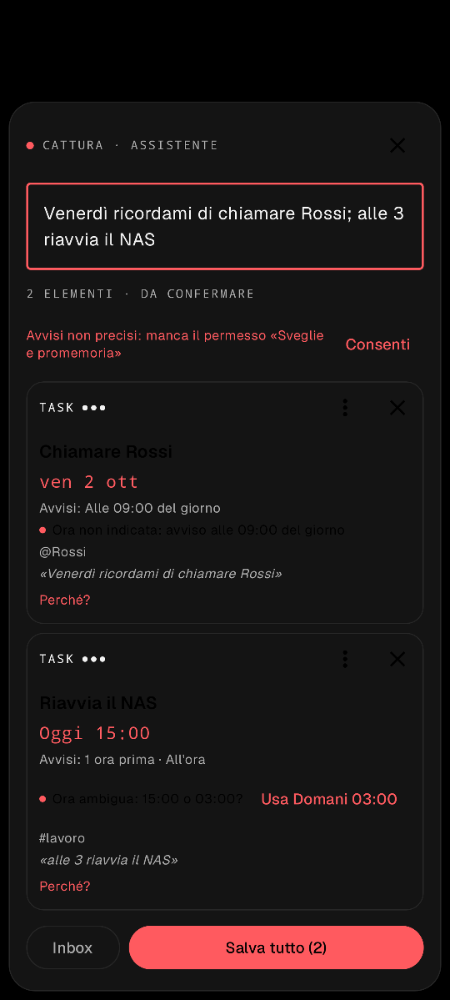
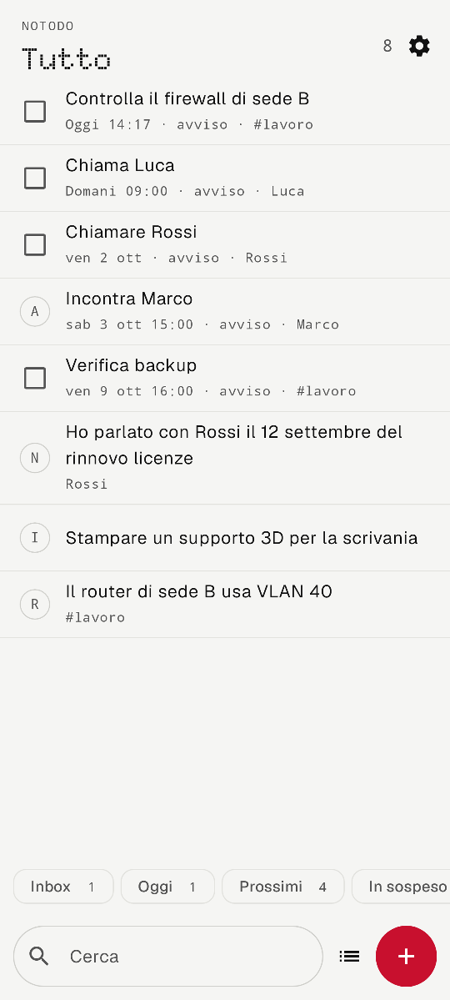
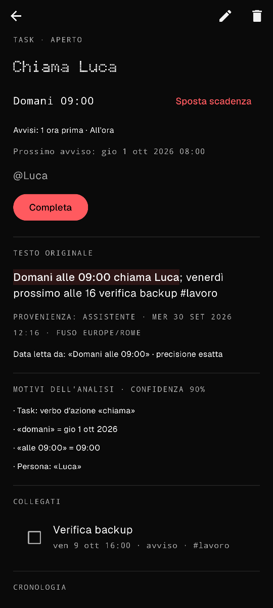
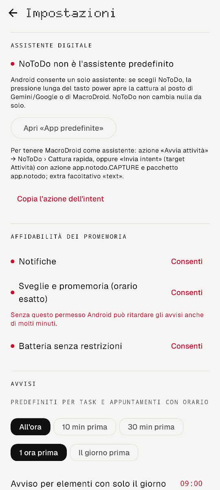
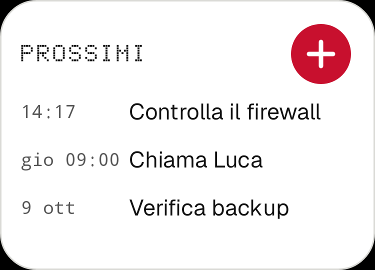
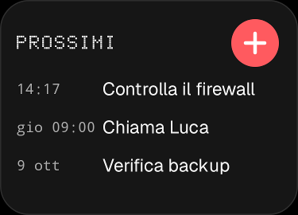

# NoToDo

Second brain per Android, offline e senza account: si cattura una frase (scritta o dettata con il microfono della tastiera), l'app la divide in elementi, riconosce date, ore, persone e tipo, mostra un'anteprima modificabile e salva solo dopo conferma. Promemoria locali, ricerca, viste, widget, riepilogo, backup leggibile.

Pensata per il Nothing Phone (3) (Android 16), interfaccia in italiano, uso con una mano.

| Cattura | Dubbi da confermare (scuro) | Tutto | Dettaglio (scuro) |
|---|---|---|---|
|  |  |  |  |

| Rimanda (dalla notifica) | Impostazioni | Widget |
|---|---|---|
|  |  |   |

Gli screenshot sono renderizzati dai test (Robolectric, grafica nativa), non da un telefono.

## Stato: implementato, testato, da verificare

| Area | Implementato | Test automatici | Da verificare sul Phone (3) |
|---|---|---|---|
| Parser italiano (date, ore, tipi, persone, tag, dubbi) | sì | 35 test JVM | frasi reali dettate con Gboard |
| Anteprima: Correggi, Unisci, Separa, Scarta, Salva tutto | sì | test UI Robolectric | uso reale a una mano |
| Salvataggio atomico, idempotente, bozza a ogni modifica, Inbox | sì | test repository e UI | kill dell'app durante la cattura |
| Viste, ricerca, filtri, dettaglio, cronologia | sì | test JVM + screenshot | TalkBack, font grandi |
| Promemoria: un allarme, snooze, «Fatto», riavvio, cambio fuso | sì | test Robolectric su AlarmManager/notifiche | puntualità reale, Doze, Nothing OS |
| Riepilogo giornaliero, riscoperta note | sì | test Robolectric | orari reali |
| Backup JSON (import senza duplicati) e Markdown | sì | test round-trip | scelta file con SAF |
| Assistente digitale (VoiceInteractionService) | sì | manifest verificato con il parser del framework | **pressione lunga power, schermo bloccato** |
| Deep link / intent MacroDroid, condivisione, scorciatoie | sì | risoluzione intent | azioni MacroDroid reali |
| Widget | sì | rendering RemoteViews | launcher Nothing |

**Nessun emulatore né telefono era disponibile** durante lo sviluppo (niente KVM nel container): tutto ciò che è nella colonna di destra non è stato provato e va verificato con il walkthrough qui sotto.

## Installazione

Build (JDK 17+, Android SDK con platform 37):

```sh
./gradlew assembleDebug          # app/build/outputs/apk/debug/app-debug.apk
./gradlew testDebugUnitTest      # 70 test
```

Installazione via USB:

```sh
adb install -r app/build/outputs/apk/debug/app-debug.apk
```

oppure copia l'APK sul telefono e aprilo (consenti «Installa app sconosciute» al file manager).

L'APK debug è firmato con una chiave di debug. Per una build di release firmata:

```sh
keytool -genkeypair -v -keystore notodo.jks -alias notodo -keyalg RSA -keysize 4096 -validity 10000
./gradlew assembleRelease
$ANDROID_HOME/build-tools/37.0.0/apksigner sign --ks notodo.jks --out notodo.apk app/build/outputs/apk/release/app-release-unsigned.apk
```

### Rilasci

Le release si pubblicano con il workflow manuale *Actions › Release › Run workflow* (tag es. `v0.1.0-alpha01`, note in `docs/release/<tag>.md`). Prima volta: aggiungi in *Settings › Secrets and variables › Actions* i secret `NOTODO_KEYSTORE_B64` (il keystore in base64) e `NOTODO_KEYSTORE_PASSWORD`. Il workflow esegue i test, firma con quella chiave e allega l'APK. La chiave non sta nel repository: senza la stessa chiave gli aggiornamenti non si installano sopra la versione esistente.

## Configurazione sul Nothing Phone (3)

1. **Notifiche**: vengono chieste al primo salvataggio con avvisi; in alternativa NoToDo › Impostazioni › *Affidabilità dei promemoria*.
2. **Sveglie e promemoria** (orario esatto): *Impostazioni › App › NoToDo › Sveglie e promemoria* oppure il pulsante «Consenti» in app. Da Android 14 è negato di default; senza, gli avvisi possono arrivare in ritardo e l'app lo segnala in anteprima e nelle impostazioni.
3. **Batteria**: *Impostazioni › App › NoToDo › Batteria › Senza restrizioni* (il pulsante in app apre l'elenco di sistema). Riduce il rischio che Nothing OS rimandi gli allarmi.
4. **Assistente digitale** (facoltativo, vedi trade-off):
   - *Impostazioni › App › App predefinite › App assistente digitale* → **NoToDo**;
   - *Impostazioni › Funzioni speciali › Gesti › Tieni premuto il tasto di accensione* → **Assistente digitale**.
   - Da quel momento la pressione lunga del tasto power apre la cattura sopra l'app corrente, con tastiera pronta; il microfono è quello di Gboard (o della tastiera in uso).
5. **Widget**: tieni premuto sulla home › Widget › *NoToDo · Prossimi*.
6. **Scorciatoia**: tieni premuta l'icona › *Cattura* (trascinabile sulla home).
7. **Condivisione**: da qualsiasi app, *Condividi › Salva in NoToDo*.

### Trade-off: un solo assistente

Android ammette un solo assistente predefinito. Scegliere NoToDo sostituisce Gemini/Google Assistant **e** MacroDroid, se era impostato come assistente per usare la pressione lunga nei suoi trigger. NoToDo non cambia nulla da solo: lo decidi tu nelle impostazioni di sistema.

Note tecniche:
- l'assistente apre solo la cattura: niente microfono, niente lettura dello schermo, niente servizio di accessibilità;
- da Android 12 scegliere un assistente **non** cambia il riconoscimento vocale di sistema (verificato sul sorgente AOSP): Gboard e le altre app continuano a usare il proprio. Se nel sistema compare un'opzione «Input vocale», non selezionare NoToDo;
- a schermo bloccato l'MVP non dichiara il supporto (`supportsLaunchVoiceAssistFromKeyguard=false`): il comportamento va verificato e, se serve, attivato in una versione successiva.

### Se MacroDroid resta l'assistente

Tre modi, dal più semplice:

1. **Avvia scorciatoia** → NoToDo › *Cattura*.
2. **Invia intent** → Target *Attività*, Azione `app.notodo.CAPTURE`, Pacchetto `app.notodo`, Classe `app.notodo.ui.CaptureActivity`; extra facoltativo `text` (stringa) per precompilare la cattura, ad esempio con il testo del riconoscimento vocale di MacroDroid.
3. **Apri URL**: `notodo://capture?text=domani%20alle%209%20chiama%20Luca`.

Il testo passato da MacroDroid finisce sempre in anteprima: niente viene salvato senza conferma.

## Come si usa

Separatori tra elementi: `;`, a capo, punto a fine frase. Nella dettatura senza punteggiatura la frase viene divisa solo se ogni parte ha un verbo d'azione e una propria data («domani alle 9 chiama Luca venerdì prossimo alle 16 verifica backup» → due task). Per il resto: *Unisci* / *Separa* sulle card, oppure modifica il testo.

| Scrivi o detta | Risultato |
|---|---|
| `oggi`, `domani`, `dopodomani`, `stasera`, `domattina` | giorno (e fascia oraria ≈, da confermare) |
| `tra 2 ore`, `fra mezz'ora`, `tra 3 giorni`, `tra una settimana` | istante esatto / giorno |
| `lunedì`… `domenica` | il prossimo; se è oggi, tra 7 giorni con dubbio e alternativa «oggi» |
| `questo venerdì` / `venerdì prossimo`, `prossimo venerdì` | venerdì di questa settimana / della settimana successiva |
| `il 5 ottobre`, `5/10`, `5/10/2027`, `1° ottobre` | data; senza anno, la prossima occorrenza |
| `alle 15`, `alle 15:30`, `ore 9`, `alle 3 e mezza`, `a mezzogiorno` | ora; 1–7 senza «di mattina/di sera» = pomeriggio, marcata ambigua |
| `verso le 16`, `intorno alle 16` | 16:00 approssimato |
| `entro venerdì`, `entro le 18` | scadenza |
| `ricordami il giorno prima`, `avvisami 30 minuti prima`, `la sera prima` | avviso anticipato sullo stesso elemento |
| `idea:`, `nota:`, `ricordati che…`, `ricordami di…`, `forse…`, `da verificare` | tipo esplicito |
| `#casa`, `@Anna`, «chiama Rossi» | tag e persone |

- Le date al passato («ho parlato con Rossi il 12 settembre») sono **date menzionate**, non scadenze.
- Nessuna ora viene inventata: un giorno senza ora resta «solo giorno» e l'avviso è alle 09:00 (modificabile), segnalato come dubbio.
- Ora già passata oggi → domani, con dubbio e alternativa. Cambio d'ora legale: orari inesistenti o ripetuti vengono segnalati.
- Non supportati (restano nel testo, niente data inventata): ricorrenze («ogni lunedì» imposta solo il prossimo e lo segnala), «la settimana prossima», «a fine mese», «il 5» senza mese, «stanotte», «mezzanotte», date con i punti («5.10.2026»).

**Avvisi**: task e appuntamenti con orario → 1 ora prima e all'ora (modificabili in Impostazioni e per elemento); note, idee e riferimenti non notificano, salvo richiesta esplicita («ricordamelo»).

**Notifica**: *Fatto*, *+15 min*, *Rimanda…* (15 min, 1 ora, domani, scegli ora). Rimandare sposta solo l'avviso; *Sposta la scadenza…* è un'azione separata. Ogni avviso inviato è registrato nella cronologia dell'elemento con orario previsto ed effettivo.

**Inbox**: ogni cattura non confermata (chiusa, abbandonata, non riconosciuta, parser in errore) resta integra in Inbox; *Elabora* la riapre in anteprima.

**Riepilogo** (08:00, disattivabile) solo se oggi c'è qualcosa; **riscoperta** al massimo una nota non aperta da 30 giorni per periodo (giorno/settimana/mai).

**Backup**: Impostazioni › Backup. JSON versionato (import che unisce per id: niente duplicati, vince la versione più recente) e Markdown leggibile.

## Walkthrough di test manuale

Prima di tutto: data e fuso automatici, NoToDo con notifiche, «Sveglie e promemoria» e batteria senza restrizioni.

1. **Assistente in elenco** — *App predefinite › App assistente digitale*: NoToDo compare. Da PC: `adb shell cmd role get-role-holders android.app.role.ASSISTANT` → `app.notodo`.
2. **Pressione lunga power** — da un'altra app: si apre la cattura sopra l'app, tastiera visibile, cursore nel campo. Senza tasto: `adb shell input keyevent KEYCODE_ASSIST`.
3. **Due task** — «Domani alle 09:00 chiama Luca; venerdì prossimo alle 16 verifica backup» → due card Task con le date giuste (venerdì della settimana successiva), avvisi 1 ora prima e all'ora; nulla salvato finché non premi *Salva tutto (2)*.
4. **Riferimento** — «Il router usa VLAN 40» → Riferimento, «VLAN 40» intatto, nessuna data né avviso.
5. **Giorno senza ora** — «Venerdì ricordami di chiamare Rossi» → Task «Chiamare Rossi», venerdì, dubbio «Ora non indicata: avviso alle 09:00»; toccando la card si sceglie un orario.
6. **Avviso il giorno prima** — «Incontra Marco il 3 ottobre alle 15; ricordami il giorno prima» → **una** card Appuntamento con avvisi «Il giorno prima» e «All'ora».
7. **Inbox** — «asdf qwer» → *Salva* → «Non riconosciuto: testo salvato in Inbox»; la vista Inbox lo mostra integro.
8. **Bozza** — scrivi qualcosa e premi Home, poi riapri la cattura: il testo è ancora lì. Scrivi di nuovo, *Impostazioni › App › NoToDo › Forza arresto*, riapri la cattura: banner «Bozza non salvata… Riprendi»; lo stesso testo è anche in Inbox.
9. **Promemoria** — «tra 3 minuti prova promemoria» → notifica dopo circa 3 minuti; nel dettaglio › Cronologia: «avviso inviato, previsto …, inviato …» (misura la puntualità).
10. **Snooze** — dalla notifica *+15 min*: una sola nuova notifica dopo 15 minuti; nel dettaglio la scadenza è invariata e compare «Rimandato a …».
11. **Riavvio** — «tra 10 minuti prova riavvio», poi `adb reboot`: la notifica arriva (o subito dopo l'avvio se l'orario è passato, una sola volta).
12. **Fuso** — disattiva il fuso automatico e imposta un altro fuso: l'avviso arriva allo stesso istante assoluto; gli orari in app restano nel fuso di NoToDo (Impostazioni › Analisi, default Europe/Rome).
13. **Doze** — `adb shell dumpsys deviceidle force-idle`, attendi un avviso, poi `adb shell dumpsys deviceidle unforce`. Stato dell'allarme: `adb shell dumpsys alarm | grep -A4 app.notodo`.
14. **Schermo bloccato** — pressione lunga power a schermo bloccato: annota cosa succede (non supportato dichiaratamente nell'MVP).
15. **MacroDroid** — `adb shell am start -n app.notodo/.ui.CaptureActivity -a app.notodo.CAPTURE --es text "domani alle 9 chiama Luca"` → cattura precompilata; poi la stessa cosa con l'azione MacroDroid *Invia intent*.
16. **Backup** — *Esporta JSON*, elimina un elemento, *Importa JSON* due volte: l'elemento torna, nessun duplicato.
17. **Accessibilità** — TalkBack attivo: card, pulsanti e caselle hanno etichette; carattere al massimo: nessun testo tagliato nelle schermate principali.
18. **Widget** — aggiunto sulla home: prossime scadenze, *+* apre la cattura, tocco su una riga apre il dettaglio.

## Architettura

Kotlin, Jetpack Compose (Material 3 con tema proprio), Room, DataStore, kotlinx.serialization; DI manuale in `App`. Nessuna libreria di rete, nessun permesso `INTERNET`.

```
app/src/main/java/app/notodo/
  parse/     ItalianParser (dietro l'interfaccia CaptureParser), Alerts, modello Draft
  data/      Room (Capture = testo originale/Inbox, Item, Audit), Repo, viste/filtri, Settings
  reminder/  Alarms (un solo allarme), Notifications, receiver
  ui/        Cattura, liste, dettaglio, impostazioni, «Rimanda…», editor, tema
  assist/    VoiceInteractionService + SessionService + Session
  widget/    RemoteViews
```

- **Flusso**: testo → bozza `Capture` salvata a ogni modifica → anteprima (`Draft`, nulla in DB) → conferma in una transazione che crea gli `Item` e marca la cattura come elaborata; una seconda conferma non fa nulla.
- **Promemoria**: ogni elemento ha gli avvisi relativi (`m60`, `d1`, `d0@09:00`), `firedUpTo`, `snoozeUntil` e il derivato `nextAlertAt`. Esiste un solo allarme di sistema, il minimo `nextAlertAt`: ripianificare è sempre idempotente e non c'è il limite dei 500 allarmi per app.
- **Date**: istante normalizzato + fuso + testo sorgente + precisione (esatta, approssimata, solo giorno) per ogni elemento; le date menzionate sono salvate a parte.
- **Ricerca**: testo normalizzato (minuscole, senza accenti) con `LIKE` per termine, per trovare anche sottostringhe tecniche come `10.0.0.1`.
- **Sync futuro**: niente interfacce premature; UUID stabili, `updatedAt` e l'export JSON versionato sono il contratto per un eventuale CalDAV/Nextcloud.

## Test automatici

`./gradlew testDebugUnitTest` — 70 test, tutti verdi nell'ultima esecuzione (JVM + Robolectric, SDK 36):

| Classe | Test | Cosa copre |
|---|---|---|
| `ItalianParserTest` | 30 | casi di accettazione, «questo/prossimo» venerdì, DST 29/03 e 25/10/2026, cambio anno, ore ambigue, dettatura, persone, tag, URL/email intatti |
| `AlertsTest` | 5 | avvisi relativi DST-safe, prossimo avviso, snooze |
| `RepoTest` | 9 | bozza, conferma atomica/idempotente, snooze, avvisi persi, export/import doppio |
| `ViewsTest` | 4 | viste, ricerca senza accenti, filtri, etichette |
| `RemindersTest` | 6 | un allarme esatto, fallback inexact, riavvio, cambio fuso, azioni della notifica |
| `DigestTest` | 2 | riepilogo solo se utile, una sola riscoperta per periodo |
| `IntegrationTest` | 3 | manifest dell'assistente accettato da `VoiceInteractionServiceInfo`, intent MacroDroid/condivisione/deep link, permessi minimi |
| `CaptureUiTest`, `EditorUiTest` | 7 | salvataggio multiplo, Inbox (non riconosciuto e parser guasto), chiusura immediata, Unisci/Rianalizza/Separa, Correggi |
| `LightScreensTest`, `DarkScreensTest`, `WidgetTest` | 4 | navigazione e screenshot in `app/build/screenshots/` |

Limiti dei test: nessuna interfaccia di sistema reale (tasto power, SystemUI, IME, Doze), allarmi verificati su `ShadowAlarmManager`. In Robolectric un campo di testo dentro un dialog non raggiunge mai l'idle alla configurazione 412dp/xxhdpi, quindi il test dell'editor gira alla configurazione di default.

## Limiti noti

- Il parser è euristico: l'anteprima con motivi, confidenza e dubbi serve proprio a correggerlo; il testo originale resta sempre salvato.
- Non ancora implementati: ricorrenze, collegamenti manuali tra elementi (i collegati sono derivati da cattura, persone e tag), backup cifrato, sincronizzazione, motore di dettatura proprio.
- Il widget si aggiorna a ogni modifica e ogni ora: dopo mezzanotte «Oggi/Domani» può restare indietro fino a un'ora.
- `targetSdk 36` (Android 16, il sistema del Phone (3)); `compileSdk 37` perché richiesto da AndroidX.
- Il parser non ha modelli locali o LLM: nessuno è stato misurato sul dispositivo, quindi non ne viene dichiarato alcuno.

## Font

Testo in [Geist](https://github.com/vercel/geist-font), titoli in [Doto](https://github.com/oliverlalan/Doto), entrambi SIL Open Font License (`docs/licenses`). NDot di Nothing non è incluso perché proprietario: per cambiare il font dei titoli basta sostituire `app/src/main/res/font/doto.ttf`.

## Privacy

Nessun account, nessun permesso Internet, nessun microfono, nessuna accessibilità, nessun log con dati personali. Il backup cloud di Android è escluso (il trasferimento diretto tra telefoni resta possibile); i contenuti delle notifiche sono nascosti sulla schermata di blocco per impostazione predefinita.
